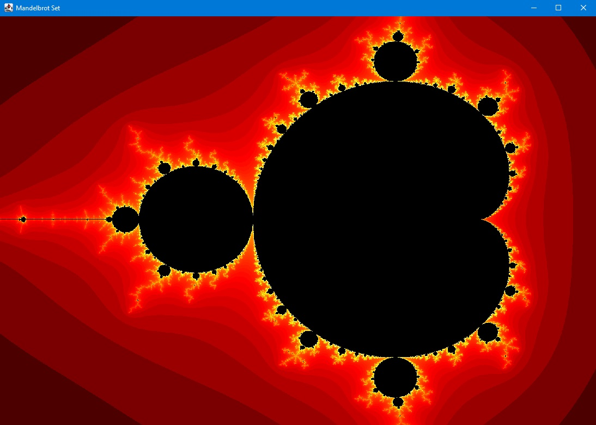

## Generate the Mandelbrot Set using Scala and Java Swing

### History

The Mandelbrot set has its origin in complex dynamics, a field first investigated by the French mathematicians Pierre Fatou and Gaston Julia at the beginning of the 20th century. This fractal was first defined and drawn in 1978 by Robert W. Brooks and Peter Matelski as part of a study of Kleinian groups.
On 1 March 1980, at IBM's Thomas J. Watson Research Center in Yorktown Heights, New York, Benoit Mandelbrot first saw a visualization of the set.

Mandelbrot studied the parameter space of quadratic polynomials in an article that appeared in 1980.The mathematical study of the Mandelbrot set really began with work by the mathematicians Adrien Douady and John H. Hubbard (1985),[1] who established many of its fundamental properties and named the set in honor of Mandelbrot for his influential work in fractal geometry.

The mathematicians Heinz-Otto Peitgen and Peter Richter became well known for promoting the set with photographs, books (1986),[5] and an internationally touring exhibit of the German Goethe-Institut (1985).

The cover article of the August 1985 Scientific American introduced a wide audience to the algorithm for computing the Mandelbrot set. The cover featured an image located at −0.909 + −0.275 i and was created by Peitgen et al.
The Mandelbrot set became prominent in the mid-1980s as a computer graphics demo, when personal computers became powerful enough to plot and display the set in high resolution.

[wikipedia article](https://en.wikipedia.org/wiki/Mandelbrot_set)